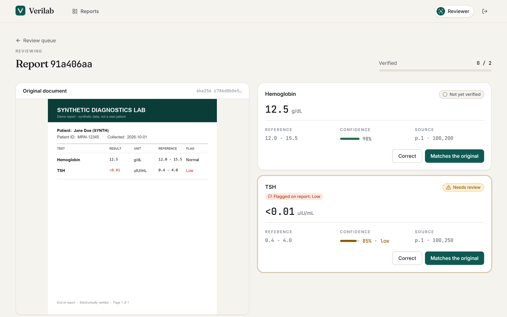
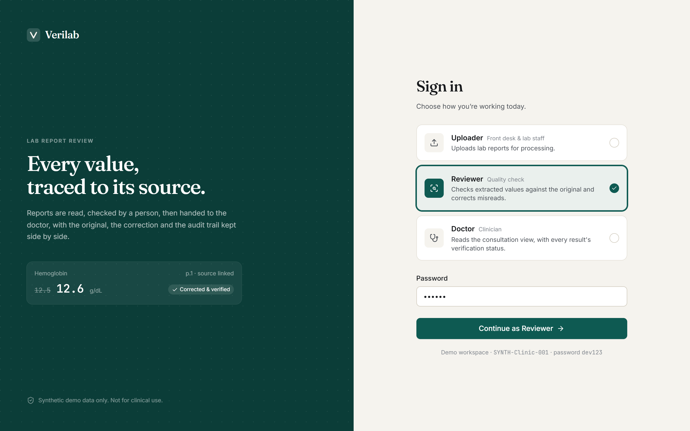
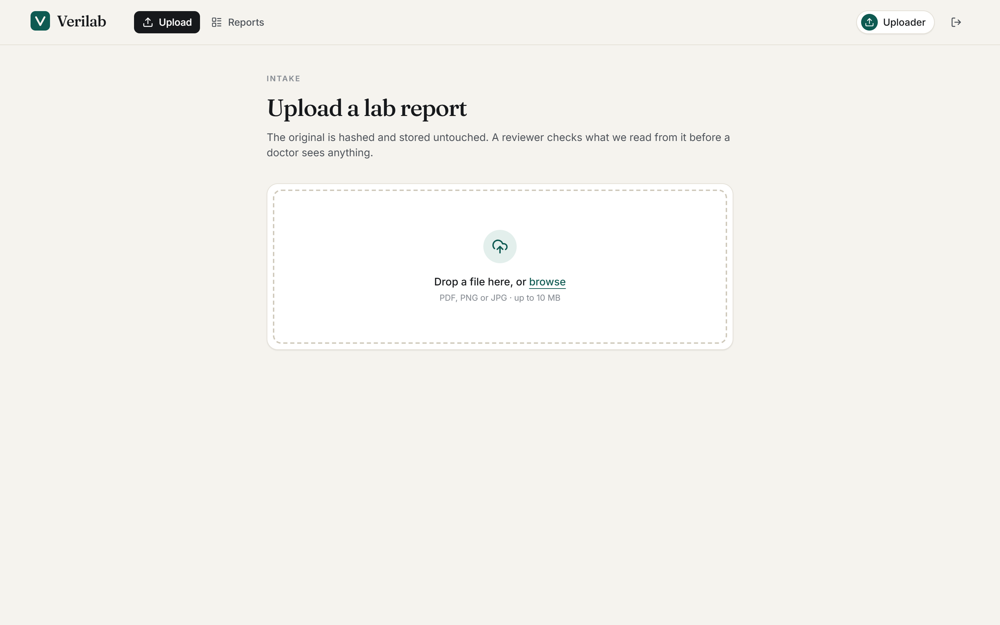
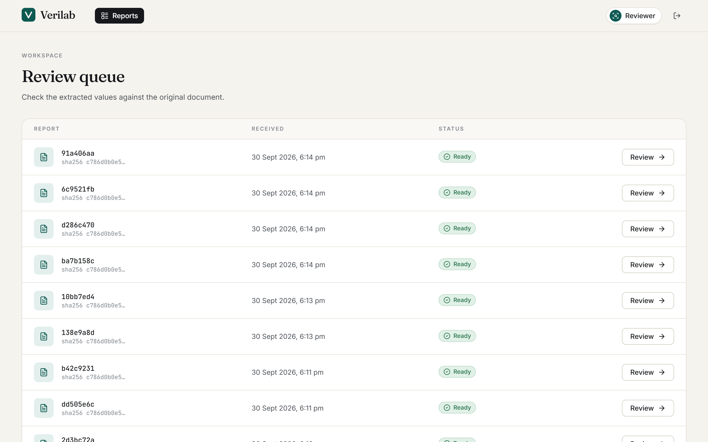
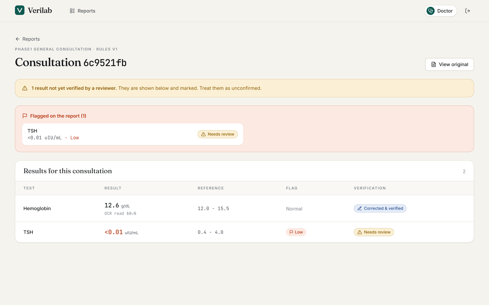

<div align="center">


# Verilab

**Lab reports, read by OCR, checked by a person, handed to the doctor with every value traced to its source.**

<sub>Phase 1 prototype · synthetic data only · not for clinical use</sub>

<br />



</div>

<br />

## What it is

Verilab is a lab-report intake and review system. An uploader sends in a PDF or photo of a lab report. OCR extracts the values. A **reviewer** checks each one against the original and corrects misreads. A **doctor** then reads a consultation view that shows every result together with how far it has been verified.

The design rule behind all of it: **a plausible-looking wrong number is worse than a slow correct one.** So the system never hides uncertainty, never overwrites what OCR read, and never drops a flagged result.

## Three roles

Sign in by choosing who you are. Each role sees only what it needs.

| Role | Does | Lands on |
|---|---|---|
| **Uploader** | Uploads lab reports and tracks them | Upload |
| **Reviewer** | Checks extracted values against the original, corrects misreads | Review queue |
| **Doctor** | Reads the consultation view, with each result's verification status | Reports |

<div align="center">

</div>

## Tour

<table>
<tr>
<td width="50%"><br /><sub><b>Upload.</b> The original is SHA-256 hashed and stored untouched.</sub></td>
<td width="50%"><br /><sub><b>Review queue.</b> Live status while OCR runs.</sub></td>
</tr>
<tr>
<td width="50%"><br /><sub><b>Review.</b> Original on the left, extracted values on the right.</sub></td>
<td width="50%"><br /><sub><b>Consultation.</b> Corrected values, pending results and flags, all visible.</sub></td>
</tr>
</table>

## Safety rules it enforces

These come from [`Docs/product/SAFETY-INVARIANTS.md`](Docs/product/SAFETY-INVARIANTS.md). The ones below are implemented and covered by tests:

- **Corrections are additive.** A correction is a new row. The OCR text is never overwritten, and the doctor sees the corrected value with the original beside it.
- **Uncertainty is never hidden.** Unverified results are shown to the doctor with a badge. Status is always text plus icon, never colour alone.
- **Flagged results always surface.** A result with a printed abnormal flag appears in the doctor's view whether or not it is on the consultation's test list, and whether or not it is verified yet.
- **Tamper-evident audit log.** Events are hash-chained over every field and written in the same transaction as the change. `verify_chain()` detects edits to history.
- **Tenant isolation.** Every query is tenant-scoped, with cross-tenant tests.
- **Originals are viewable, and every view is audited.**

## Quick start

**Requirements:** Python 3.12+, Node 18+.

```bash
# Backend: http://127.0.0.1:8000  (API docs at /docs)
cd backend
python -m venv venv
venv\Scripts\activate            # macOS/Linux: source venv/bin/activate
pip install -r requirements.txt
python -m uvicorn main:app --reload --host 127.0.0.1 --port 8000

# Frontend: http://localhost:5173  (new terminal)
cd frontend
npm install
npm run dev
```

The first run creates and seeds a SQLite database. Open the app, pick a role, and sign in. The demo password is shown on the sign-in page in development builds.

### OCR

By default Verilab runs with `OCR_PROVIDER=mock`, which returns the **same fixed demo results for every upload**. It exists to demo the review flow, not to read your files.

For real extraction set `OCR_PROVIDER=tesseract` and install the [Tesseract](https://github.com/tesseract-ocr/tesseract) binary (plus [Poppler](https://poppler.freedesktop.org/) for PDFs). The Tesseract provider reads single-line result rows (`Name value unit range flag`) and uses Tesseract's own confidence. It never invents values. On failure the report goes to `error`.

### Tests

```bash
cd backend
TESTING=1 python -m pytest        # PowerShell: $env:TESTING=1; python -m pytest
```

### Configuration

| Variable | Default | Notes |
|---|---|---|
| `DATABASE_URL` | `sqlite:///./verilab_dev.db` | PostgreSQL for staging and production |
| `SECRET_KEY` | dev-only key | **Required** when `ENVIRONMENT` is not `development`. The app refuses to start without it |
| `ENVIRONMENT` | `development` | |
| `OCR_PROVIDER` | `mock` | `mock` or `tesseract` |
| `ALLOWED_ORIGINS` | localhost:5173/5174 | Comma-separated |
| `VITE_API_BASE_URL` | `http://127.0.0.1:8000` | Frontend → backend address |

## Tech

**Frontend:** React 18, TypeScript, Vite, Tailwind CSS. **Backend:** FastAPI, SQLAlchemy 2, Pydantic v2, JWT auth. **Data:** SQLite in development, PostgreSQL planned. **OCR:** Tesseract behind an `OCRProvider` interface, so a managed provider can replace it.

```
backend/   FastAPI app: routers, services (intake, OCR), models, audit, tests
frontend/  React app: role-aware shell, review and consultation views
Docs/      PRD, TRD, schema, safety invariants, traceability matrix
AUDIT.md   Candid engineering audit and fix order
```

## Status

Phase 1 vertical slice: upload → OCR → review → correct → consultation → audit. Still to come:

- [ ] Patient matching (never on name alone)
- [ ] Clickable bounding-box overlay on the original
- [ ] PostgreSQL with Row-Level Security
- [ ] MFA for clinical roles
- [ ] Rules service for consultation test lists and clinician-approved critical definitions
- [ ] Managed, India-region OCR provider
- [ ] CI

See [`AUDIT.md`](AUDIT.md) for the full list of known gaps.

## Disclaimer

Verilab is a prototype. It is **not a medical device**, it gives no diagnostic or treatment advice, and it must not be used with real patient data.
